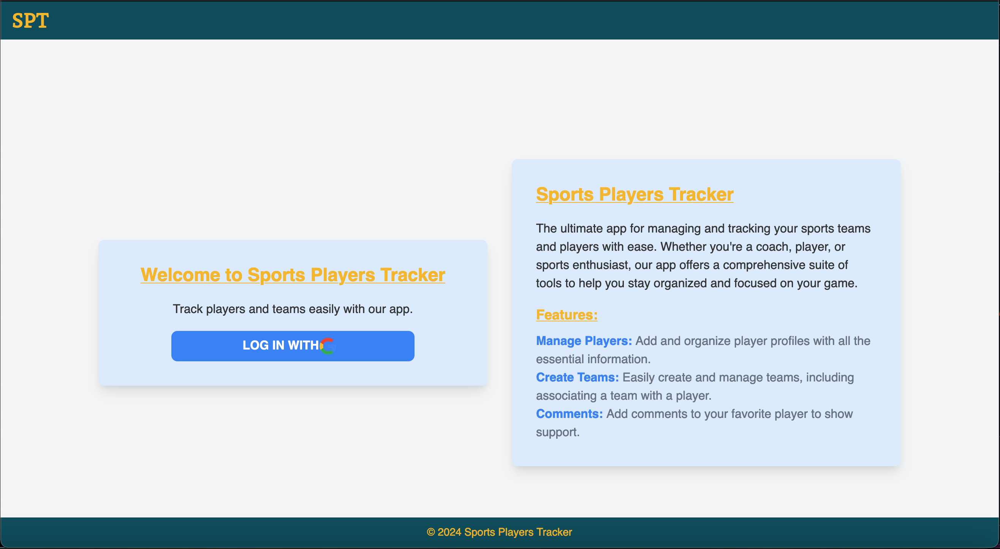

# Sports Players Tracker

 

## Description

Sports Players Tracker is a web application that allows users to manage and track sports players and teams. Users can add, and view details of players and teams. The application also includes features such as commenting on players and managing associations between players and teams.

## Technology Used

- **JavaScript**: Implements the application's logic and interactivity.
- **Node.js**: Used as the server-side runtime environment.
- **Express**: A web application framework for Node.js, used to build the backend.
- **MongoDB**: A NoSQL database used to store player and team data.
- **HTML**: Provides the structure and layout of the application.
- **CSS**: Handles the application's styling and user interface design.
- **Tailwind CSS**: A utility-first CSS framework used for styling the application.

## Live Link

You can check out the live version of the application [here]().
